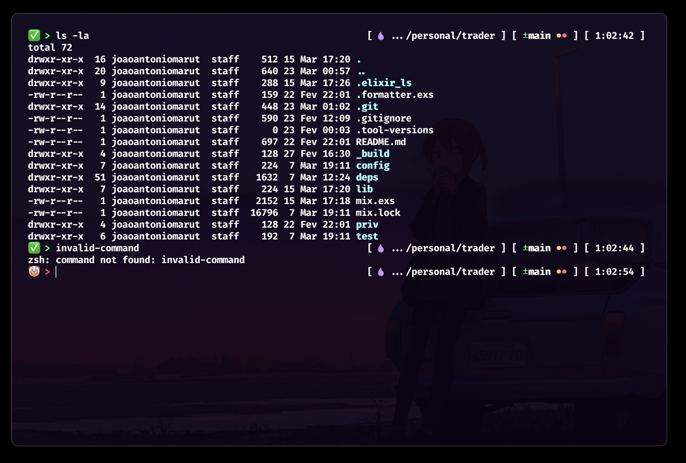

# JAMM Terminal Theme

A minimalistic terminal theme (prompt) that does not have any visual noise. Displays only the necessary information: virtual env, current user, hostname, working directory, and git branch if exists.

The prompt shows the path, username, and hostname, and also adds an icon based on the file type in the current directory.
### Technologies
 - Elixir
 - JavaScript
 - Dart
 - Vim

## Installation

### **zsh** — the Z shell

#### If you're using Oh My Zsh

1. Download theme: \
   `git clone --quiet https://github.com/joaoantoniomaruti/jamm-terminal-theme ~/.oh-my-zsh/custom/themes/jamm`
2. Select theme using `omz`: \
   `omz theme set jamm/jamm`
3. Reload current zsh session: `omz reload`

---
_Developed by [João Maruti](https://github.com/joaoantoniomaruti)_
